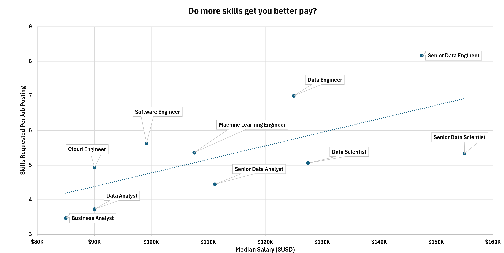
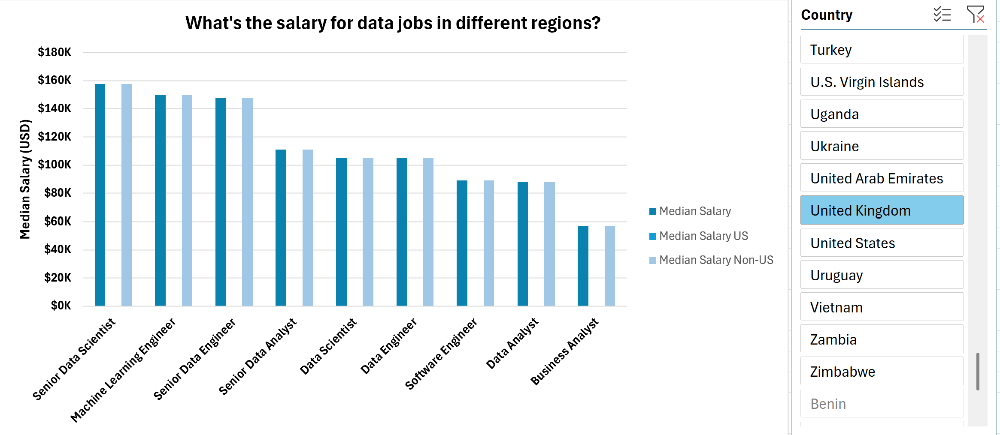
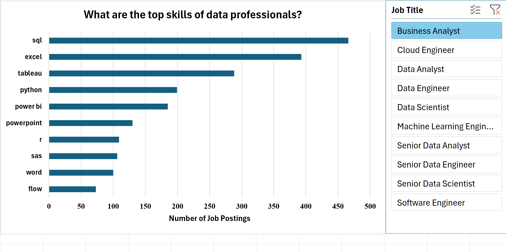
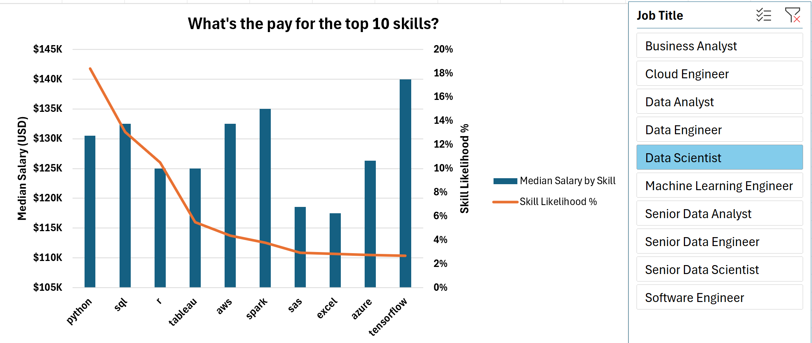

# Data Jobs Salary Analysis (Excel: Power Query, Power Pivot, DAX)

An Excel-based analysis of **32,672 real-world data job postings**, exploring what skills top employers request and how they affect pay. Built independently using Power Query for ETL, Power Pivot for data modeling, and DAX for calculated measures — including verified findings that caught calculation errors present in the tutorial reference this project was learned from.

📊 **[View the full build process and debugging log →](./BUILD_LOG.md)**

---

## Introduction

As a self-taught Excel learner, I built this project to go beyond following a tutorial passively — every step was performed independently, with each result checked and, where the numbers looked questionable, re-verified against the underlying data rather than assumed correct. Along the way, this approach surfaced and fixed genuine calculation issues that the original reference project did not catch.

### Questions Analyzed

1. Do more skills get you better pay?
2. What's the salary for data jobs in different regions?
3. What are the top skills of data professionals?
4. What's the pay for the top 10 skills?

### Excel Skills Used

- 🔍 **Power Query** — ETL, list-splitting/explosion, source-level data cleaning
- 💪 **Power Pivot** — Data Model, One-to-Many relationships
- 🧮 **DAX** — CALCULATE, CROSSFILTER, KEEPFILTERS, DISTINCTCOUNT, DIVIDE
- 📊 **PivotTables & PivotCharts** — including combo charts, scatter workarounds, slicers
- 🔗 **Interactive Slicers** — with independently verified filter-context behavior

### Dataset

Real-world data job postings dataset (32,672 rows, 16 columns), including job titles, salaries, locations, and skills, sourced via an Excel training course.

---

## 1️⃣ Do more skills get you better pay?

**Method:** Built a `Avg Skills per Job` and `Median Salary` measure via Power Query (exploding a list-style skills column into one row per skill) and DAX, then plotted the relationship as a scatter chart with a linear trendline.

**Insight:** There's a clear positive relationship between the number of skills a posting requires and its median salary. Business Analyst and Data Analyst roles cluster at the low end on both dimensions (3.5–3.7 skills, $85K–$90K), while Senior Data Engineer and Senior Data Scientist sit at the high end (5.3–8.2 skills, $147K–$155K).

**So What:** Roles demanding a broader skill set command meaningfully higher pay — supporting the case for continuous, deliberate skill-building rather than narrow specialization, especially for senior or engineering-heavy roles.

---

## 2️⃣ What's the salary for data jobs in different regions?

**Method:** Built three DAX measures (`Median Salary`, `Median Salary US`, `Median Salary Non-US`) and compared them across job titles, with an interactive country slicer for deeper exploration.

*Includes an interactive country slicer (shown selected on "United States" above) — verified to correctly respect DAX filter context using KEEPFILTERS.*

**Insight:** US-based postings pay at or above the global median for every job title, with the largest gaps in specialist roles: Machine Learning Engineer (~40% higher in the US), Cloud Engineer (~28%), and Software Engineer (~26%). Data Engineer and Senior Data Scientist show almost no US premium.

**So What:** Regional salary disparity isn't uniform — it's concentrated in specific roles. This matters for negotiation and relocation/remote-work decisions, since some skills carry a real US-market premium while others don't.

---

## 3️⃣ What are the top skills of data professionals?

**Method:** Counted skill mentions across all postings (post-ETL, one row per job-skill pair) and ranked the top 10, with a job-title slicer to explore role-specific skill demand.

**Insight:** SQL (18,500 mentions) and Python (17,689) dominate by a wide margin — more than double the third-place skill, Tableau (7,046). Cloud platforms (AWS, Azure) and Excel round out the top 10.

**So What:** SQL and Python aren't optional extras — they're baseline expectations across the vast majority of data roles. Anyone building a data career should treat these as non-negotiable foundations before specializing further.

---

## 4️⃣ What's the pay for the top 10 skills?

**Method:** Combo PivotChart — median salary as bars, skill likelihood (%) as a line on a secondary axis — for the same top 10 skills identified in Q3.

**Insight:** Pay stays relatively consistent across the top 10 skills (~$92K–$140K), but *demand* varies dramatically — SQL and Python's likelihood of being requested (57% and 54%) is far higher than the rest of the top 10, which drops to a 7–22% range.

**So What:** Demand, not pay, is what most differentiates these skills. Choose which skill to learn next based on demand and how it compounds with your existing skills, not salary alone — the top 10 pay fairly similarly.

---

## Notable Technical Challenges

Rather than assuming every calculation was correct once it "ran," I independently verified results at each stage — which surfaced some genuinely interesting problems:

- **Caught a filter-context bug in a DAX measure using CROSSFILTER**, discovered a second DAX behavior where `CALCULATE`'s column filter *replaces* rather than *combines with* an active slicer filter by default — fixed using `KEEPFILTERS`, then verified the fix against three independent test cases (checking not just that numbers changed, but that the relationships between measures remained mathematically consistent).
- **Cross-checked the reference tutorial's own charts and found real errors**: an "overall" salary figure that was silently being filtered by an active slicer (producing an implausible $197,500 median), and an impossible 225%+ "skill likelihood" value — both avoided in this rebuild through independent verification rather than trusting the reference blindly.
- **Diagnosed and fixed a Power Query step-ordering bug** where punctuation cleanup running after a text-split step left stray characters in the exploded skill data.
- **Permanently resolved a recurring blank-category issue** by fixing it at the Power Query source rather than fighting conflicting PivotTable-level filters.

Full build process, including every issue hit and how it was diagnosed and fixed, is documented in [BUILD_LOG.md](./BUILD_LOG.md).

---

## Conclusion

This project set out to answer practical questions about the data job market — and along the way became as much a lesson in rigorous verification as in Excel mechanics. The most valuable finding wasn't any single chart, but the discipline of checking every number against its own internal logic before trusting it, which caught real errors that a surface-level read of the same reference project would have missed.
